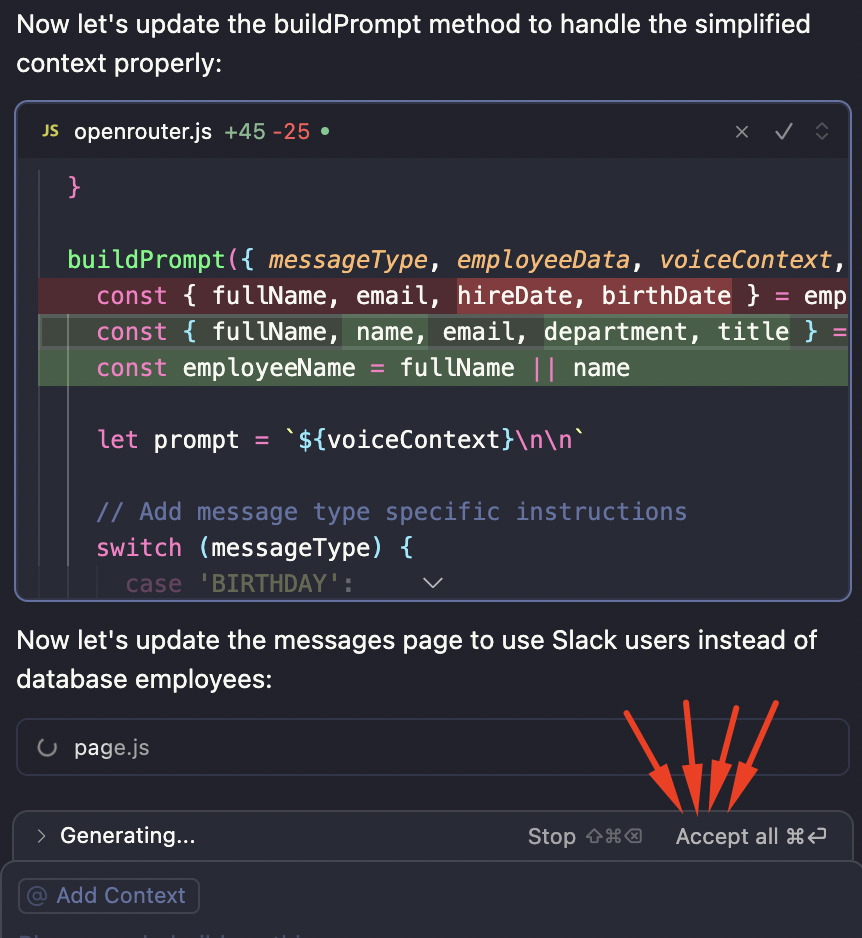
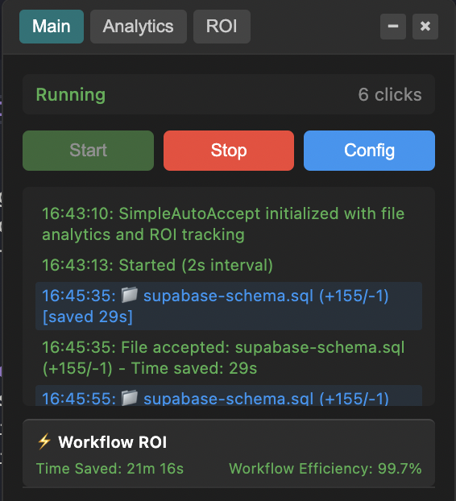
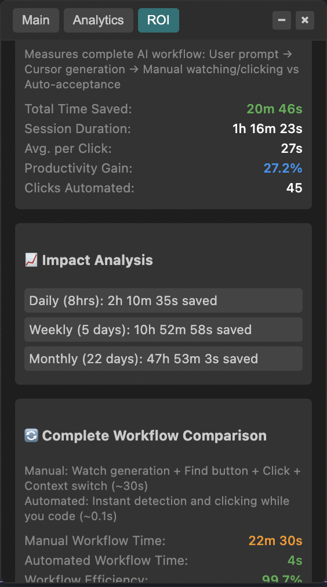
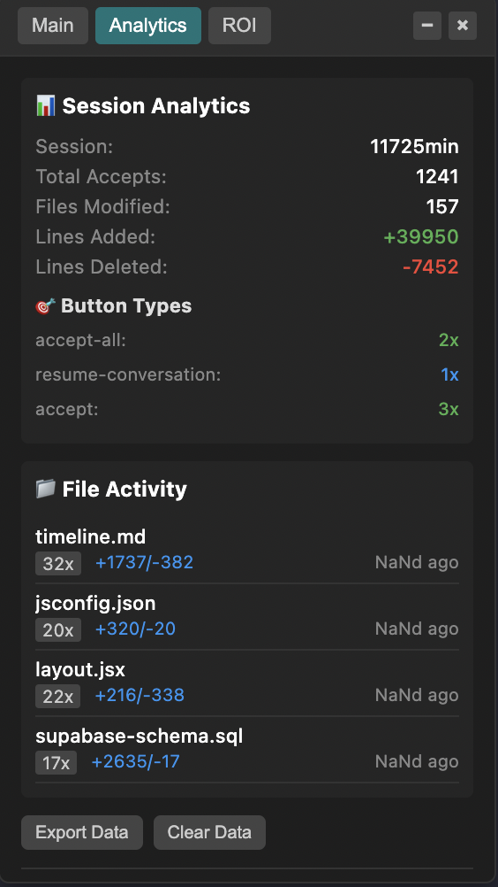
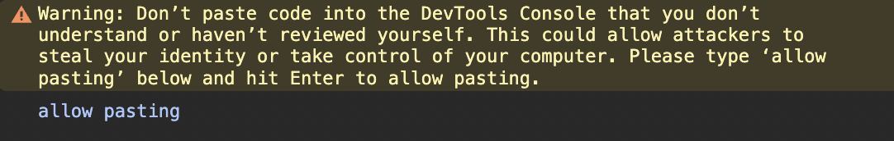

# TRUE YOLO MODE - Cursor Auto-Accept & Analytics Script

[](https://opensource.org/licenses/MIT)
[](https://cursor.sh/)
[](https://linkedin.com/in/ivalsaraj)

# ‼️ DO NOT USE IT, AI LLM MODELS CAN MAKE MISTAKES, THIS WORKS FOR SMALL PROJECTS BUT FOR LARGE PROJECTS ALWAYS REVIEW THE CODE, VERIFY THE CODE OF LLM, DON'T BLINDLY TRUST LLM MODEL
## TRUST, BUT VERIFY!
### Why can't Cursor work fully-agentic like Bolt, Loveable, or v0 even with high efficient models? Like "Prompt to Production" or "True Yolo Mode", Here is the answer of "How to make it"!
**🪄 Automagically clicks "Accept", "Accept All", "Run", "Resume Conversation" Cursor AI suggestions with comprehensive analytics, conversation analysis, and ROI tracking.**
##
<div align="center">
  
  
  
  
</div>

## 🎯 What This Does

This advanced script automatically clicks "Accept", "Accept All", "Run", "Resume Conversation", and similar buttons in Cursor IDE, eliminating manual clicking during AI-assisted coding sessions. It provides comprehensive analytics on files modified, conversation analysis, separated button type tracking, and **calculates precise time savings with ROI metrics**.

## ⚡ Key Features

### 🤖 Smart Automation
- **Multi-IDE Support**: Works with both Cursor and Windsurf IDEs with automatic detection
- **Universal Button Detection**: Accept, Run, Apply, Execute, Resume Conversation
- **Conversation-Based File Detection**: Finds files from latest diff blocks in conversation
- **Universal File Support**: Works with ANY file type (JS, CSS, Python, SQL, etc.)
- **Resume Conversation Auto-Click**: Automatically continues when hitting 25 tool call limit
- **Connection Failure Support**: Auto-clicks Resume/Try again during connection issues
- **Zero Interruption**: Works silently in background maintaining development flow

### 📊 Advanced Analytics  
- **Separated Button Analytics**: Color-coded tracking for different button types
  - 🟢 **Accept/Accept All**: Standard file acceptances 
  - 🟠 **Run/Run Command**: Command executions
  - 🔵 **Resume Conversation**: Session continuations  
  - 🔴 **Connection Resume/Try Again**: Connection failure recovery
  - 🟣 **Apply/Execute**: Other actions
- **File Change Tracking**: Lines added/deleted per file with timestamps
- **Conversation Analysis**: Diff block detection and development progress monitoring
- **Session Statistics**: Duration, clicks, files modified, productivity metrics

### ⚡ ROI & Time Tracking
- **Precise Time Calculations**: Based on complete AI workflow automation
- **Productivity Gain**: Real percentage increases in coding efficiency  
- **Button-Specific Savings**: Different time values for different action types
- **Session Projections**: Daily/weekly/monthly time savings estimates

### 🎮 Interactive Control Panel
- **Draggable Interface**: Position anywhere on screen
- **Three-Tab Layout**: Main controls, Analytics, ROI tracking
- **Real-Time Updates**: Live activity logs and status indicators
- **Configuration Controls**: Enable/disable specific button types
- **Data Export**: Download complete analytics as JSON

### 🔍 Conversation Intelligence
- **Diff Block Analysis**: Automatically detects code changes in conversation
- **File Change Monitoring**: Tracks modifications across development session
- **Recent Activity Analysis**: Configurable time windows for activity tracking
- **Development Progress Insights**: Understand coding velocity and patterns

## 🚀 Installation

### Method 1: Copy & Paste (Recommended)
1. Copy entire content from `cursor-auto-accept-simple.js` (or use minified `cursor-auto-accept-simple.min.js`)
2. Open **Cursor** or **Windsurf** → **Help** → **Toggle Developer Tools** 
3. Go to **Console** tab
4. Type `allow pasting` and press Enter (if prompted)
5. Paste script content and press Enter
6. Script loads with `[autoAcceptAndAnalytics] SCRIPT LOADED AND ACTIVE! (IDE detected)` message

This is important step (STEP 4 above)

### Method 2: Direct Download
1. Download `cursor-auto-accept-simple.js` from repository
2. Follow console steps above

### Method 3: Bookmarklet
Create browser bookmark with script content for easy loading.

### Method 4: Minified Version
For faster loading, use the professionally minified version:
1. Use `cursor-auto-accept-simple.min.js` instead of the full version
2. **53%+ smaller file size** (133KB → 62KB) for faster loading
3. **Terser-optimized** with preserved function names and syntax validation
4. Same functionality, professionally compressed
5. Rebuild with `npm run build` or `node build.js` after making changes

## 📖 Usage Guide

### 🎮 Basic Controls
```javascript
// Start automation (also available as global shortcut)
startAccept()

// Stop automation
stopAccept()

// Check current status
acceptStatus()

// Show control panel
globalThis.simpleAccept.showControlPanel()
```

### ⚙️ Configuration
```javascript
// Enable only specific button types
enableOnly(['accept', 'run', 'resume'])

// Enable/disable individual types  
enableButton('accept')
disableButton('execute')
toggleButton('apply')

// Enable/disable all button types
enableAll()
disableAll()
```

**Supported Types**: `accept`, `acceptAll`, `run`, `runCommand`, `apply`, `execute`, `resume`, `connectionResume`, `tryAgain`

### 📊 Analytics & Data
```javascript
// Show analytics in control panel
showAnalytics()

// Export complete analytics data
exportAnalytics()

// Clear all analytics data
clearAnalytics()

// Validate data integrity
validateData()

// Clear all storage and reset
clearStorage()
```

### 🔍 Conversation Analysis
```javascript
// Find all diff blocks in conversation
findDiffs()

// Get conversation overview with file changes
getContext()

// Log detailed conversation activity
logActivity()

// Find recent diff blocks (default 30 seconds)
recentDiffs()
recentDiffs(60000) // Custom time window in milliseconds
```

### 🐛 Debug Controls
```javascript
// Enable detailed file extraction logging
enableDebug()

// Disable debug logging
disableDebug()

// Toggle debug mode
toggleDebug()

// Manual button search for troubleshooting
debugAccept()
```

### ⚡ ROI Calibration
```javascript
// Calibrate workflow timing (default: 30 seconds manual workflow)
calibrateWorkflow(30)

// Custom calibration with manual and automated times
calibrateWorkflow(25, 100) // 25s manual, 100ms automated
```

## 🎛️ Control Panel Features

### 📊 Main Tab
- **Start/Stop Controls**: Large visual buttons with status indicators
- **Real-Time Counter**: Shows current session clicks
- **Activity Log**: Timestamped log with file names and button types
- **Configuration Checkboxes**: Individual button type toggles
- **Status Display**: Running/Stopped with session duration

### 📈 Analytics Tab
- **Session Overview**: Duration, total clicks, files modified
- **🎯 Button Types**: Color-coded breakdown of button usage
  - Accept/Accept All (Green)
  - Run/Run Command (Orange)  
  - Resume Conversation (Blue)
  - Apply/Execute (Purple)
- **📁 File Activity**: Individual file modification history
- **Export/Clear Controls**: Data management functions

### ⚡ ROI Tab  
- **Complete Workflow ROI**: Time savings from full AI workflow automation
- **Session Metrics**: Total time saved, productivity gain percentage
- **Performance Analysis**: Average time per click, efficiency calculations
- **Impact Projections**: Estimated daily/weekly/monthly savings
- **Workflow Explanation**: Understanding of measurement methodology

## 🤖 Resume Conversation Feature

### Automatic Session Continuation
- **25 Tool Call Limit Detection**: Automatically detects when Cursor reaches limit
- **Auto-Click Resume Links**: Finds and clicks "Resume Conversation" markdown links
- **Seamless Workflow**: Maintains development momentum during long sessions
- **Analytics Integration**: Tracks resume actions separately with blue color coding
- **Configuration Control**: Can be enabled/disabled like other button types

### Technical Implementation
```javascript
// Target elements for resume detection
'.markdown-link[data-link="command:composer.resumeCurrentChat"]'

// Enable/disable resume functionality
enableButton('resume')
disableButton('resume')
```

## 🌐 Connection Failure Support

### Automatic Connection Recovery
- **Connection Failed Detection**: Automatically detects connection failure dropdowns
- **Auto-Click Resume/Try Again**: Finds and clicks connection recovery buttons
- **Internet/VPN Issues**: Handles "check your internet connection or VPN" scenarios
- **Seamless Recovery**: Maintains workflow during network interruptions
- **Separate Analytics**: Tracks connection recovery actions with red color coding

### Supported Connection Scenarios
- **Slow Internet**: Auto-clicks "Resume" when connection is slow
- **No Internet**: Auto-clicks "Try again" when connection fails
- **VPN Issues**: Handles VPN-related connection problems
- **Network Timeouts**: Automatically retries failed requests

### Technical Implementation
```javascript
// Target elements for connection failure detection
'.bg-dropdown-background' // Connection failure dropdown containers
'.anysphere-secondary-button' // Resume/Try again buttons

// Enable/disable connection failure support
enableButton('connectionResume')
enableButton('tryAgain')
disableButton('connectionResume')
disableButton('tryAgain')
```

### Configuration Control
```javascript
// Enable only connection failure buttons
enableOnly(['connectionResume', 'tryAgain'])

// Check current configuration
acceptStatus()
```

## 🔄 Multi-IDE Support

### Automatic IDE Detection
- **Smart Detection**: Automatically detects whether running in Cursor or Windsurf
- **Adaptive Selectors**: Uses IDE-specific DOM selectors and button patterns
- **Seamless Experience**: Same functionality across both IDEs
- **Debug Information**: Shows detected IDE in startup message and logs

### Supported IDEs
- **Cursor IDE**: Full support with original selectors and patterns
- **Windsurf IDE**: Complete support with Windsurf-specific class detection
- **Automatic Fallback**: Global button search if IDE detection fails

### IDE-Specific Features

#### Cursor IDE
- Uses `div.full-input-box` as anchor point
- Targets `.anysphere-*` button classes
- Supports `.composer-code-block-container` file detection

#### Windsurf IDE  
- Uses `.bg-ide-editor-background` containers
- Targets `.bg-ide-button-background` and `.text-ide-button-color` classes
- Supports both `button` and `span` clickable elements

### Technical Implementation
```javascript
// IDE detection method
detectIDE() {
    // Checks for IDE-specific DOM elements and classes
    // Returns 'cursor' or 'windsurf'
}

// IDE-specific button detection
if (this.ideType === 'windsurf') {
    return this.isWindsurfAcceptButton(element);
} else {
    return this.isCursorAcceptButton(element);
}
```

### Debug IDE Detection
```javascript
// Check detected IDE
console.log(globalThis.simpleAccept.ideType);

// Enable debug mode to see IDE-specific detection logs
enableDebug()
```

## 📁 Universal File Detection

### Conversation-Based Approach
- **Latest Message Analysis**: Searches most recent conversation messages by `data-message-index`
- **Diff Block Detection**: Finds code blocks in `div.conversations` container
- **Universal File Support**: Detects ANY file type through pattern matching
- **Fallback System**: Multiple detection methods for reliability

### File Types Supported
- **Programming**: `.js`, `.ts`, `.py`, `.java`, `.cpp`, `.c`, `.cs`, `.go`, `.rust`, `.php`
- **Web**: `.html`, `.css`, `.scss`, `.sass`, `.less`, `.vue`, `.jsx`, `.tsx`
- **Data**: `.json`, `.xml`, `.yaml`, `.yml`, `.toml`, `.csv`, `.sql`
- **Config**: `.env`, `.config`, `.ini`, `.conf`, `.dockerfile`
- **Documentation**: `.md`, `.txt`, `.rst`, `.tex`
- **And many more**: Any file with an extension

### Debug File Detection
```javascript
// Enable detailed file extraction logging
enableDebug()

// View current conversation context
getContext()

// See latest diff blocks
findDiffs()
```

## 🔢 Time Savings & ROI Calculations

### Workflow Time Measurements
- **Manual Workflow**: User prompt → Watch AI generation → Find button → Click → Context switch
- **Automated Workflow**: User prompt → Script auto-clicks → Continue coding
- **Time Savings**: Difference between manual and automated workflows

### Button-Specific Timing
```javascript
const workflowTimeSavings = {
    'accept': 30000,      // 30 seconds base workflow
    'accept-all': 35000,  // +5s extra review time
    'run': 32000,         // +2s caution for commands  
    'execute': 32000,     // +2s caution for execution
    'apply': 30000,       // 30s base workflow
    'resume': 33000       // +3s conversation continuity bonus
};
```

### ROI Metrics
- **Total Time Saved**: Cumulative seconds/minutes saved
- **Productivity Gain**: `(timeSaved / sessionDuration) * 100`
- **Efficiency Rate**: `automatedTime / manualTime * 100`
- **Average Per Click**: `totalTimeSaved / totalClicks`

## 🛠️ Troubleshooting

### File Names Not Showing
```javascript
// Enable debug mode to see extraction process
enableDebug()

// Check conversation context
getContext()

// Manual file detection test  
findDiffs()
```

**Common Causes**:
- No recent diff blocks in conversation
- File names not in expected elements
- Debug mode shows exact extraction attempts

### NaN Values in Analytics
✅ **Fixed**: All calculations now have safe number validation
- Added `isNaN()` checks with fallback to 0
- Protected division operations
- Safe variable handling throughout

### Button Detection Issues
```javascript
// Manual debug search
debugAccept()

// Check which buttons are enabled
acceptStatus()

// Test specific button types
enableOnly(['accept'])
```

### Control Panel Issues
```javascript
// Force show panel
globalThis.simpleAccept.showControlPanel()

// Reset panel position (if dragged off-screen)
globalThis.simpleAccept.hideControlPanel()
globalThis.simpleAccept.showControlPanel()
```

### Console Errors
✅ **TrustedHTML Fixed**: Uses DOM creation instead of innerHTML
✅ **Security Compliant**: No direct HTML injection
✅ **Cross-Browser Compatible**: Modern JavaScript standards

## 📊 Analytics Data Structure

### Exported JSON Format
```json
{
  "session": {
    "start": "2024-12-27T10:00:00.000Z",
    "duration": 3600000,
    "totalAccepts": 67
  },
  "buttonTypeCounts": {
    "accept": 42,
    "run": 15,
    "resume-conversation": 8,
    "apply": 2
  },
  "roiTracking": {
    "totalTimeSaved": 201000,
    "averageCompleteWorkflow": 30000,
    "productivityGain": 18.5
  },
  "files": {
    "cursor-auto-accept-simple.js": {
      "acceptCount": 15,
      "totalAdded": 387,
      "totalDeleted": 45,
      "buttonTypes": {
        "accept": 12,
        "apply": 3
      },
      "lastAccepted": "2024-12-27T10:45:00.000Z"
    }
  }
}
```

## 🔗 Advanced Commands Reference

### Global Shortcuts
```javascript
startAccept()                    // Start automation
stopAccept()                     // Stop automation  
acceptStatus()                   // Check status
debugAccept()                    // Debug search
```

### Configuration
```javascript
enableOnly(['accept', 'run'])    // Enable only specified types
enableAll()                      // Enable all button types
disableAll()                     // Disable all button types
toggleButton('resume')           // Toggle specific type
enableButton('apply')            // Enable specific type
disableButton('execute')         // Disable specific type
```

### Analytics
```javascript
showAnalytics()                  // Switch to analytics tab
exportAnalytics()                // Export data as JSON
clearAnalytics()                 // Clear analytics data
clearStorage()                   // Reset everything
validateData()                   // Check data integrity
```

### Debug
```javascript
enableDebug()                    // Enable file extraction logging
disableDebug()                   // Disable debug logging
toggleDebug()                    // Toggle debug mode
```

### Conversation Analysis  
```javascript
findDiffs()                      // Find all diff blocks
getContext()                     // Get conversation overview
logActivity()                    // Log recent activity
recentDiffs(60000)               // Recent diffs (60s window)
```

### Calibration
```javascript
calibrateWorkflow(30)            // Set manual workflow time (30s)
calibrateWorkflow(25, 100)       // Custom manual + automated timing
```

## 🎨 UI Customization

### Control Panel
- **Draggable**: Click and drag header to reposition
- **Minimizable**: Click minimize button to hide content
- **Resizable**: Adjust tabs and content areas
- **Color Coded**: Different colors for different button types
- **Dark Theme**: Professional dark interface with gradients

### Button Type Colors
- 🟢 **Accept/Accept All**: `#4CAF50` (Green)
- 🟠 **Run/Run Command**: `#FF9800` (Orange)  
- 🔵 **Resume Conversation**: `#2196F3` (Blue)
- 🔴 **Connection Resume/Try Again**: `#FF5722` (Orange-Red)
- 🟣 **Apply/Execute**: `#9C27B0` (Purple)

## 📈 Performance & Impact

### Typical Session Results
- **50 automated clicks** in 1-hour session
- **2.5 minutes direct time savings** (click time only)
- **15-20% productivity increase** (including flow state maintenance)
- **Reduced cognitive load** from manual button watching
- **Better focus** on actual coding vs UI interaction

### Workflow Efficiency
- **Manual**: 30-35 seconds per AI interaction cycle
- **Automated**: 0.1-0.5 seconds per interaction  
- **Efficiency Gain**: 99%+ time reduction for button interactions
- **Flow State**: Maintained focus on coding rather than UI clicking

## 🔒 Privacy & Security

- **No Data Transmission**: All analytics stored locally in browser
- **No External Requests**: Script operates entirely offline
- **localStorage Only**: Data persists in browser storage
- **Open Source**: Full transparency of all functionality
- **No Tracking**: No analytics sent to external servers

## 🆕 Recent Updates

### Version 2.0 (December 2024)
- ✅ **Universal File Detection**: Works with any file type
- ✅ **Conversation-Based Analysis**: Diff block detection
- ✅ **Resume Conversation Support**: Auto-continue at 25 tool limit
- ✅ **Separated Button Analytics**: Color-coded button type tracking
- ✅ **Enhanced Debug Logging**: Detailed file extraction debugging
- ✅ **Fixed NaN Issues**: Safe number validation throughout
- ✅ **Improved UI**: Better analytics display and controls

## 🤝 Contributing

1. Fork the repository
2. Create feature branch (`git checkout -b feature/amazing-feature`)
3. Commit changes (`git commit -m 'Add amazing feature'`)
4. Push to branch (`git push origin feature/amazing-feature`)
5. Open Pull Request

## 📄 License

MIT License - see [LICENSE](LICENSE) file for details.

## 👨‍💻 Created By

**Valsaraj R** ([@ivalsaraj](https://linkedin.com/in/ivalsaraj))

- 🐦 X: [@ivalsaraj](https://twitter.com/ivalsaraj)
- 💼 LinkedIn: [ivalsaraj](https://linkedin.com/in/ivalsaraj)
- 🌐 Website: [valsaraj.com](https://valsaraj.com)

## ⭐ Support

If this script saves you time and improves your Cursor workflow, please:
- ⭐ Star this repository
- 🐛 Report bugs or request features
- 📢 Share with other Cursor users
- 💡 Contribute improvements

---

<div align="center">
  <strong>Happy Coding with Automated Cursor! 🚀</strong>
  <br>
  <em>Maximize your productivity with intelligent AI workflow automation</em>
</div> 
