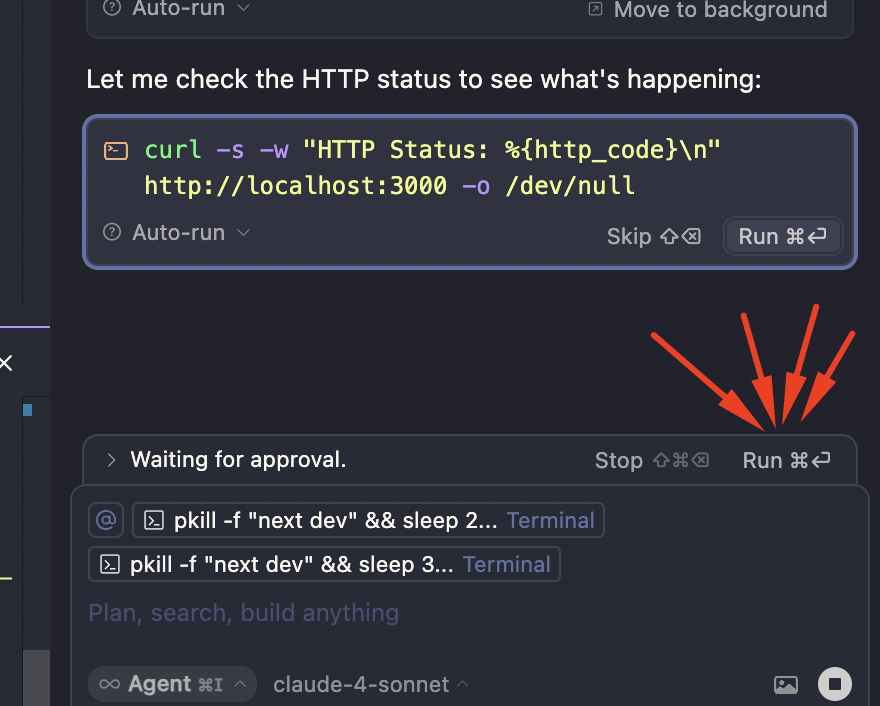

# Cursor Auto-Accept Script with Analytics & ROI Tracking

[](https://opensource.org/licenses/MIT)
[](https://cursor.sh/)
[](https://linkedin.com/in/ivalsaraj)

**Automatically accept Cursor AI suggestions with comprehensive analytics and time savings calculations.**

<div align="center">
  
  
  
  
</div>

## 🎯 What This Does

This script automatically clicks "Accept", "Accept All", "Run", and similar buttons in Cursor IDE, eliminating the need for manual clicking during AI-assisted coding sessions. It provides detailed analytics on files modified, lines changed, and **calculates your time savings with ROI metrics**.

## ⚡ Key Features

- **Smart Auto-Clicking**: Automatically detects and clicks accept/run buttons
- **File Analytics**: Track which files are modified, lines added/deleted
- **ROI Time Tracking**: Calculate exact time savings vs manual clicking
- **Productivity Metrics**: See efficiency gains and productivity percentages
- **Draggable UI**: Control panel you can position anywhere on screen
- **Zero Interruption**: Works silently in the background
- **Full Control**: Start/stop, configure button types, export data

## 📊 Time Savings & ROI

### What the ROI Tracking Shows:
- **Total Time Saved**: Exact seconds/minutes saved per session
- **Productivity Gain**: Percentage increase in coding efficiency  
- **Daily/Weekly/Monthly Projections**: Estimated time savings over longer periods
- **Manual vs Automated**: Comparison of time with/without automation
- **Average Time Per Click**: How much time each automated action saves

### Time Calculations:
- **Manual clicking**: ~2-3 seconds per button (finding + clicking + context switching)
- **Accept All buttons**: +1 second extra (reading multiple changes)
- **Run/Execute buttons**: +0.5 seconds extra (mental confirmation)
- **Automated clicking**: ~0.1 seconds (near-instantaneous)

**Example**: In a 1-hour coding session with 50 auto-accepts, you save approximately **2.5 minutes** of pure clicking time, plus reduced cognitive load and better flow state.

## 🚀 Quick Installation

### Method 1: Copy & Paste (Easiest)
```javascript
// Copy the entire content from cursor-auto-accept-simple.js
// Paste into Cursor Developer Tools console
// Press Enter
```

### Method 2: Direct Download
1. Download `cursor-auto-accept-simple.js`
2. Open Cursor → **Help** → **Toggle Developer Tools**
3. Go to **Console** tab
4. Type `allow pasting` and press Enter
5. Copy entire script content and paste
6. Press Enter

### Method 3: Bookmarklet (Advanced)
Create a browser bookmark with the script content as the URL.

## 📖 Complete Usage Guide

### Basic Controls
```javascript
// Start automation
globalThis.simpleAccept.start()

// Stop automation  
globalThis.simpleAccept.stop()

// Check status
globalThis.simpleAccept.status()

// Show/hide control panel
globalThis.simpleAccept.showControlPanel()
```

### Button Type Configuration
```javascript
// Enable only specific button types
globalThis.simpleAccept.enableOnly(['accept', 'run'])

// Enable/disable individual types
globalThis.simpleAccept.enable('acceptAll')
globalThis.simpleAccept.disable('execute')

// Toggle specific type
globalThis.simpleAccept.toggle('apply')

// Enable/disable all
globalThis.simpleAccept.enableAll()
globalThis.simpleAccept.disableAll()
```

### Analytics & Data Export
```javascript
// Export analytics data
globalThis.simpleAccept.exportAnalytics()

// Clear all data
globalThis.simpleAccept.clearAnalytics()

// Switch to ROI tab
globalThis.simpleAccept.switchTab('roi')
```

## 🎮 Control Panel Features

The draggable control panel includes three tabs:

### 📊 Main Tab
- **Start/Stop** buttons with visual status
- **Real-time click counter**
- **Live activity log** with timestamps
- **Configuration checkboxes** for different button types

### 📈 Analytics Tab  
- **Session statistics** (duration, total accepts, files modified)
- **File activity log** with line change counts
- **Export/Clear data** functions
- **Creator credits** and links

### ⚡ ROI Tab (NEW!)
- **Total time saved** in current session
- **Productivity gain percentage**
- **Average time saved per click**
- **Daily/Weekly/Monthly projections**
- **Manual vs Automated comparison**
- **Efficiency gain calculations**

## 🔧 Supported Button Types

The script recognizes and clicks these patterns:
- ✅ "Accept all" / "Accept All ⌘⏎"
- ✅ "Accept" / "Accept ⌘⏎"  
- ✅ "Run command" / "Run"
- ✅ "Execute" / "Apply"
- ✅ Custom patterns (configurable)

## 📈 Analytics Data Structure

Exported data includes:
```json
{
  "session": {
    "start": "2024-01-01T10:00:00.000Z",
    "duration": 3600000,
    "totalAccepts": 45
  },
  "roiTracking": {
    "totalTimeSaved": 135000,
    "averageTimePerClick": 3000,
    "productivityGain": 15.2
  },
  "files": {
    "app.js": {
      "acceptCount": 12,
      "totalAdded": 156,
      "totalDeleted": 23,
      "lastAccepted": "2024-01-01T10:30:00.000Z"
    }
  }
}
```

## 🛠️ Troubleshooting

### Console Errors Fixed
❌ **TrustedHTML Error**: Fixed by using DOM creation instead of innerHTML
✅ **Solution**: Script now creates all elements programmatically

### Common Issues

**Q: Buttons aren't being clicked**
- Check if the control panel shows "Running" status
- Verify button types are enabled in configuration
- Use `debugSearch()` to see what elements are found

**Q: Control panel not visible**
- Run: `globalThis.simpleAccept.showControlPanel()`
- Check if it's minimized (click restore button)
- Try refreshing Cursor and re-running script

**Q: Analytics not updating**
- Switch between tabs to refresh data
- Check that file extraction is working properly
- Files must have recognizable diff stats

**Q: Can't see author credits**
- Credits now appear at bottom of both Analytics and ROI tabs
- Ensure you're scrolled to bottom of panel

### Debug Commands
```javascript
// Debug what elements are found
globalThis.simpleAccept.debugSearch()

// Check current configuration
globalThis.simpleAccept.status()

// View all analytics data
globalThis.simpleAccept.analytics
```

## 🎨 Customization

### Modify Time Calculations
```javascript
// Adjust time savings per button type (in milliseconds)
globalThis.simpleAccept.roiTracking.manualClickTime = 3000 // 3 seconds per manual click
globalThis.simpleAccept.roiTracking.averageWaitTime = 5000  // 5 seconds watching/waiting
```

### Change Check Interval
```javascript
// Check for buttons every 1 second instead of 2
globalThis.simpleAccept.interval = 1000
```

### Modify Button Patterns
Edit the `isAcceptButton()` method to recognize different text patterns.

## 🔗 Links & Resources

- **GitHub Repository**: [cursor-auto-accept-full-agentic-mode](https://github.com/ivalsaraj/cursor-auto-accept-full-agentic-mode)
- **Creator**: [@ivalsaraj](https://linkedin.com/in/ivalsaraj)
- **Gist**: [Complete Script with Instructions](https://gist.github.com/ivalsaraj/cursor-auto-accept-gist)

## 📊 ROI Benefits Summary

**Immediate Benefits:**
- ⚡ 2-3 seconds saved per button click
- 🧠 Reduced cognitive load and context switching
- 🎯 Maintained flow state during coding
- 📈 Measurable productivity improvements

**Long-term Benefits:**
- ⏰ Hours saved per month for active Cursor users
- 🚀 Faster iteration and development cycles  
- 💰 Quantifiable ROI for development teams
- 📊 Data-driven insights into coding patterns

## 🤝 Contributing

Found a bug or want to add features? 
1. Fork the repository
2. Create your feature branch
3. Submit a pull request

## 📄 License

MIT License - Use freely in personal and commercial projects.

---

**Created by [@ivalsaraj](https://linkedin.com/in/ivalsaraj)** | **[GitHub](https://github.com/ivalsaraj)**

## 🎛️ Control Panel

The control panel features two tabs:

### Main Tab
- **Start/Stop** buttons for script control
- **Config** button to show/hide button type checkboxes
- **Real-time status** and click counter
- **Live log** of all button clicks

### Analytics Tab
- **Session statistics** (duration, total accepts, files modified)
- **File activity list** with modification counts and diff stats
- **Export Data** button to save analytics as JSON
- **Clear Data** button to reset session statistics

## 📊 File Analytics Features

The script now tracks:
- **File names** from code blocks when buttons are clicked
- **Lines added/deleted** from diff statistics (`+15/-8` format)
- **Acceptance frequency** per file
- **Time stamps** for first and last modifications
- **Session data** for productivity analysis

Example analytics display:
```
📊 Session Analytics
Session: 45min
Total Accepts: 23
Files Modified: 5
Lines Added: +156
Lines Deleted: -89

📁 File Activity
index.js - 5x (+45/-12) 2min ago
README.md - 3x (+23/-5) 5min ago
package.json - 1x (+2/-0) 15min ago
```

## 📚 Usage Guide

### Basic Commands

```javascript
// Control the script
startAccept()    // Start auto-clicking
stopAccept()     // Stop auto-clicking
acceptStatus()   // Check current status
debugAccept()    // Debug button detection

// Analytics commands (new!)
globalThis.simpleAccept.exportAnalytics()  // Export analytics data
globalThis.simpleAccept.clearAnalytics()   // Clear session data
```

### Button Type Control

#### Enable Only Specific Buttons
```javascript
enableOnly(['accept'])                    // Only Accept buttons
enableOnly(['run'])                       // Only Run buttons
enableOnly(['accept', 'run'])             // Accept and Run buttons
enableOnly(['acceptAll'])                 // Only Accept All buttons
enableOnly(['run', 'runCommand'])         // All Run-type buttons
```

#### Individual Button Control
```javascript
enableButton('run')                       // Enable Run buttons
disableButton('accept')                   // Disable Accept buttons
toggleButton('acceptAll')                 // Toggle Accept All on/off
```

#### Bulk Operations
```javascript
enableAll()                               // Enable all button types
disableAll()                              // Disable all (pause clicking)
```

### Supported Button Types

| Type | Description | Example Buttons |
|------|-------------|-----------------|
| `acceptAll` | Accept all suggestions | "Accept all ⌘⏎" |
| `accept` | Accept single suggestion | "Accept" |
| `run` | Run/execute code | "Run" |
| `runCommand` | Run specific commands | "Run command" |
| `apply` | Apply changes | "Apply" |
| `execute` | Execute operations | "Execute" |

## 💡 Common Use Cases

### For AI Code Generation
```javascript
// Only auto-accept AI suggestions
enableOnly(['accept', 'acceptAll'])
```

### For Terminal/Command Execution
```javascript
// Only auto-run commands
enableOnly(['run', 'runCommand'])
```

### For Code Reviews
```javascript
// Only apply changes, no auto-execution
enableOnly(['apply'])
```

### Temporary Pause
```javascript
disableAll()          // Pause all clicking
// ... do manual work ...
enableAll()           // Resume all clicking
```

## 🔧 Configuration Examples

### Scenario 1: Safe Mode (Accept Only)
```javascript
enableOnly(['accept', 'acceptAll'])
startAccept()
```

### Scenario 2: Full Automation
```javascript
enableAll()
startAccept()
```

### Scenario 3: Development Mode (No Auto-Run)
```javascript
enableOnly(['accept', 'acceptAll', 'apply'])
disableButton('run')
disableButton('runCommand')
```

### Scenario 4: Toggle Run Commands
```javascript
toggleButton('run')        // Turn run buttons on/off
acceptStatus()             // Check current state
```

## 📊 Monitoring

### Check Script Status
```javascript
acceptStatus()
```

**Returns:**
```javascript
{
  isRunning: true,
  interval: 2000,
  totalClicks: 15,
  config: {
    enableAcceptAll: true,
    enableAccept: true,
    enableRun: false,
    enableRunCommand: false,
    enableApply: true,
    enableExecute: true
  }
}
```

### Debug Button Detection
```javascript
debugAccept()
```

**Sample Output:**
```
[AutoAccept] 2025-01-04T11:24:47.518Z - === DEBUG SEARCH ===
[AutoAccept] 2025-01-04T11:24:47.519Z - Input box found, checking siblings...
[AutoAccept] 2025-01-04T11:24:47.520Z - Sibling 1: DIV hide-if-empty
[AutoAccept] 2025-01-04T11:24:47.521Z -   Text: "Accept all ⌘⏎"
[AutoAccept] 2025-01-04T11:24:47.522Z -   >>> Contains patterns: accept
[AutoAccept] 2025-01-04T11:24:47.523Z -   Found 1 clickable buttons!
[AutoAccept] 2025-01-04T11:24:47.524Z -     Button 1: "Accept all ⌘⏎"
```

## 🛠️ Troubleshooting

### Script Not Finding Buttons
1. Run `debugAccept()` to see what's detected
2. Check if buttons are visible on screen
3. Verify button text matches supported patterns

### Console Logs Not Showing
1. Check console filter settings (enable "Info" and "Log")
2. Clear console and reload script
3. Ensure you're in the main Cursor window console

### Script Stops Working
1. Check if Cursor was restarted (script needs reinstalling)
2. Run `acceptStatus()` to verify script is running
3. Restart with `startAccept()`

### Buttons Being Clicked Too Fast/Slow
```javascript
// Change check interval (in milliseconds)
globalThis.simpleAccept.interval = 1000  // Check every 1 second
globalThis.simpleAccept.interval = 5000  // Check every 5 seconds
```

## ⚠️ Important Notes

- **Script is session-based**: Reloading Cursor requires reinstalling the script
- **Developer Tools must stay open**: Script runs in the console context
- **Visual confirmation**: Watch the console for click confirmations
- **Safe by design**: Only clicks visible, enabled buttons

## 🔒 Security & Safety

- Script only interacts with Cursor's UI elements
- No external network requests
- No file system access
- No sensitive data handling
- Open source and auditable

## 📝 Example Session

```javascript
// 1. Install script (paste in console)
// [SimpleAutoAccept] Ready with full control!

// 2. Check what's currently enabled
acceptStatus()
// { isRunning: true, config: { enableAcceptAll: true, ... } }

// 3. Configure for safe AI assistance
enableOnly(['accept', 'acceptAll'])
// [AutoAccept] Configuration updated: Only accept, acceptAll buttons enabled

// 4. Work with AI, script auto-accepts suggestions
// [AutoAccept] Found button: Accept all ⌘⏎
// [AutoAccept] Successfully clicked accept button (Total: 1)

// 5. Switch to command mode
enableOnly(['run', 'runCommand'])
// [AutoAccept] Configuration updated: Only run, runCommand buttons enabled

// 6. Pause when needed
disableAll()
// [AutoAccept] All button types disabled

// 7. Resume
enableAll()
// [AutoAccept] All button types enabled
```

## 🤝 Contributing

1. Fork the repository
2. Create a feature branch
3. Test with Cursor IDE
4. Submit a pull request

## 📄 License

MIT License - feel free to use and modify!

## 🐛 Issues & Support

- **Bug Reports**: Open an issue with console output and steps to reproduce
- **Feature Requests**: Describe your use case and desired functionality
- **Questions**: Check existing issues or start a discussion

## 👨‍💻 Credits

**Created by [@ivalsaraj](https://linkedin.com/in/ivalsaraj)**

- 🔗 **LinkedIn**: [linkedin.com/in/ivalsaraj](https://linkedin.com/in/ivalsaraj)
- 🐙 **GitHub**: [github.com/ivalsaraj](https://github.com/ivalsaraj)
- 📧 **Repository**: [cursor-auto-accept-full-agentic-mode](https://github.com/ivalsaraj/cursor-auto-accept-full-agentic-mode)

---

**Made for the Cursor IDE community** 🚀

*Streamline your AI-assisted development workflow with intelligent auto-clicking and comprehensive analytics* 